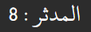

الحمد لله والصلاة والسلام على رسول الله

يمكنك استعمال هذه الرزمة لحفظ العدّ المدنيّ الأخير ومراجعة القرآن: البطاقات لها أمام وخلف ووسم واحد. الأمام لرقم الآية بالعدّ المدنيّ الأخير مثل: 
، والخلف للآية الموافقة لذلك العدد م

